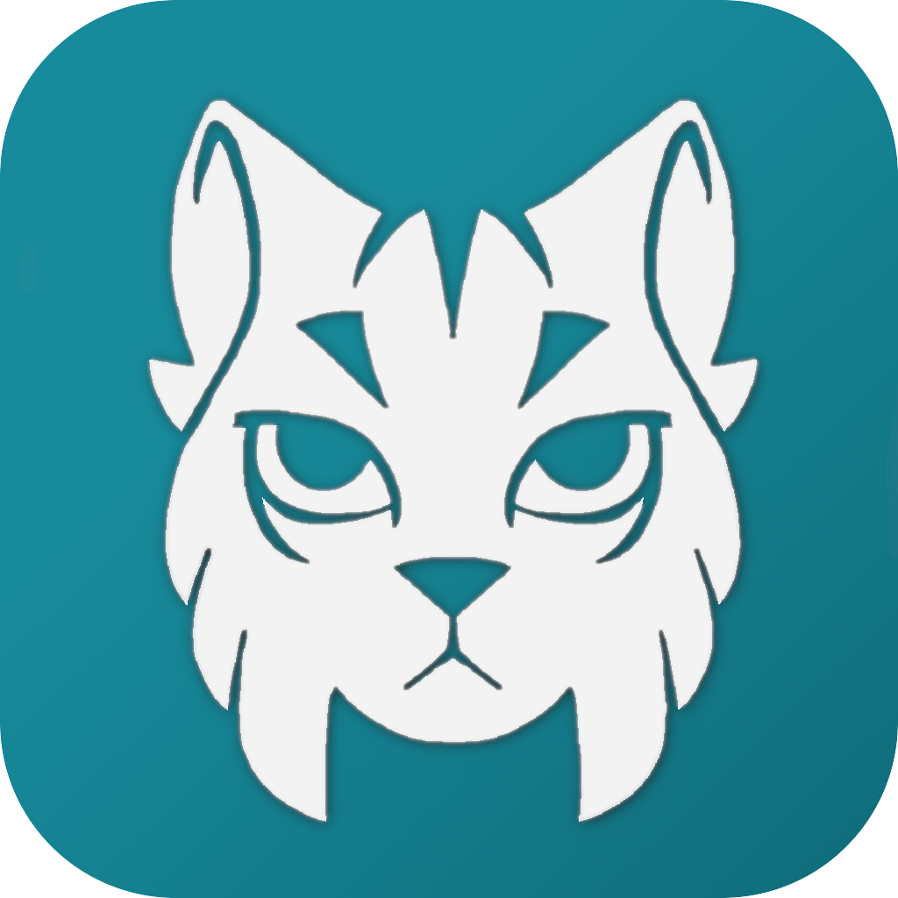
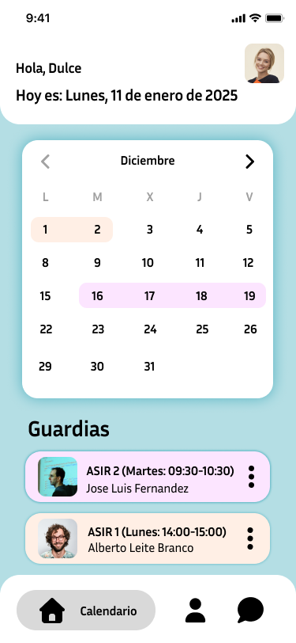

  
  <h2><strong>Linguardia</strong></h2>

<!-- <h1 align="center">Linguardia </h1> -->

### Descripción

**Linguardia** es una aplicación tanto para ios como mac, diseñada para los profesores, en dicha aplicación se podrá tener un seguimiento de las guardias del centro educativo, tanto de las guardias de clases como las guardias de las zona del recreo

  

### Registrarse
Para entrar a la aplicación de linguardia es obligatorio registrarse en ella con un corre en espeficico, dicho correo debera de ser registrado y colocado en la bd por direcctivos superiores como jefatura o los propios administradores, si no esta en la bd o se escribe mal saldra un error.
Tendras dos opciones dependiendo si la persona ya esta registrado o debe iniciar sesion.

  
  
  

### Notificaciones
Los profesores que tengas una guardia le llegara una notificación al inicio del dia, igual forma si hay algún cambio en mitad de hora de clase también le llegará una notificación, esta notificación será de la aplicación, tambien en notificaciones pueden llegar mensajes de secretaria o entre profesores.

  

### Interfaz
En la aplicación se podrá ver el horario tanto diario como semanal de las clases que requieren guardias, como el profesor que debe acudir a esta misma

  

### Perfil
Cada usuario puede entrar a configuracion de su perfil, donde podra ver datos de su perfil, configurar la pagina o cerrar sesión.

  

### IA
La aplicación incluye un servicio de ayuda con IA en la parte inferior derecha, esa ia tendra el nombre de “nombre”

### Usuarios

Linguardria está separado por varios usuarios: 

  * **Administradores de Sistemas:** Son los encargados de la creación y mantenimiento de la aplicación
  * **Jefatura:** Son los que coordinan las guardias, añade los horarios de las guardias, y supervisa cualquier cambio en está
  * **Profesores:** Son la mayoría de los usuarios, estos usuarios solo pueden ver las guardias disponibles y añadir si va a faltar para que se modifique la guardia

### Tecnico

la arquitectura que se usa es de cliente-servidor, donde el cliente es el usuario que use la aplicación y el servidor es el Docker con Apache

Usaremos Docker para crear un servidor web con Apache. Este servidor actuará como el cerebro de nuestra app, gestionando la información y las peticiones que le envíe el móvil.

La base de datos usada para guardar los datos de los maestro como de las  guardias es MySQL

En la parte de programación vamos a usar principalmente PHP y Python

Para organizar y administrar los datos en el grupo usamos Git y GitHub

### Creadores

Sara 

Fernando 

Dario

Lucia

Nuria

Jazmin

