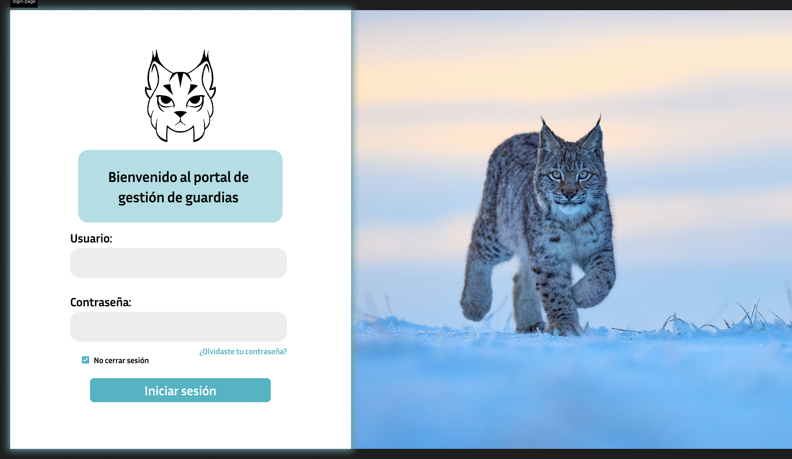
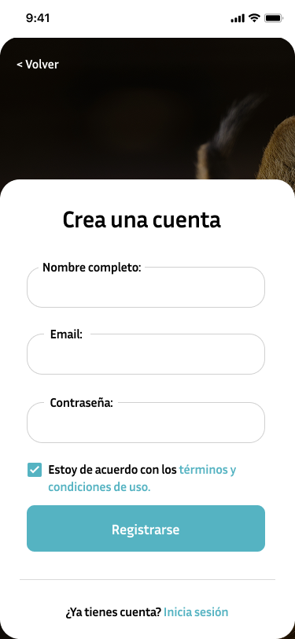
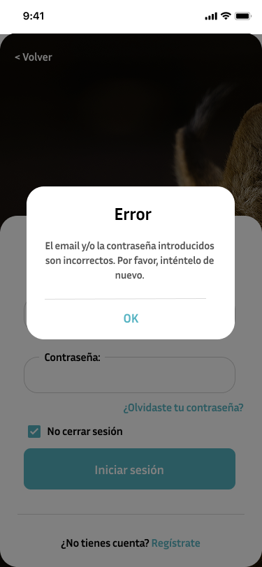
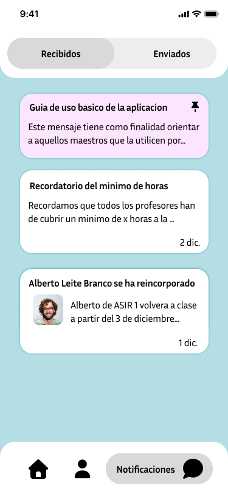
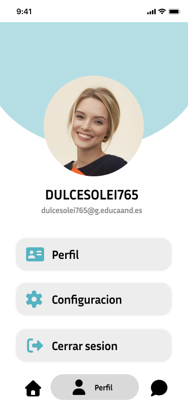
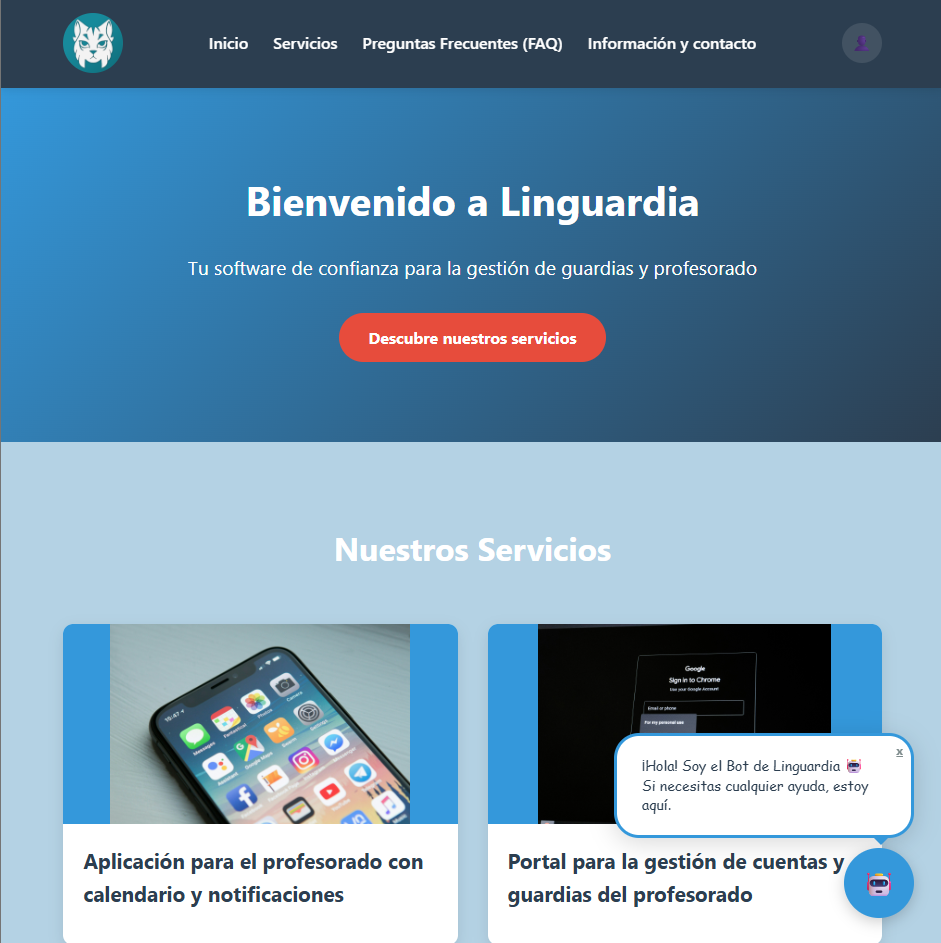
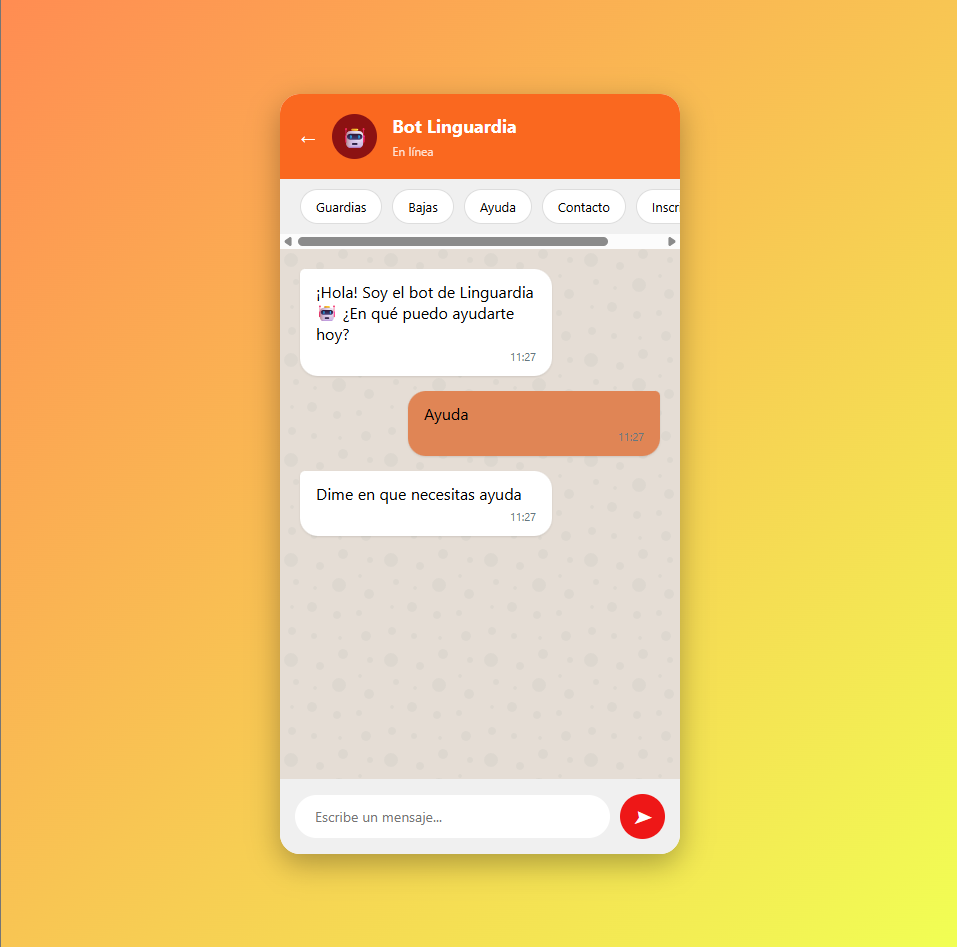

  
  <h2><strong>Linguardia</strong></h2>

### Descripción

**Linguardia** es una aplicación de escritorio y una móvil diseñada para los profesores para facilitar la gestión de las guardias. Esta permite tener un seguimiento de estas en el centro educativo (tanto de clases como recreo) y gestionar profesores a través de un portal administrativo.

  

### Registrarse
Para entrar a la aplicación de linguardia es obligatorio registrarse en ella con el correo de profesor g.educaand.es: dicho correo debera de ser registrado y colocado en la base de datos por directivos superiores como jefatura o los propios administradores. Si el correo no ha sido registrado por el administrador, se producirá un error.

  
  
  

### Notificaciones
Los profesores que tengan una guardia tendrán una notificación al inicio del dia con las guardias que deben realizar. De igual forma, si hay algún cambio en mitad de hora de clase, también le llegará una notificación. Además de estas notificaciones de la aplicación, tambien pueden llegar mensajes de secretaria directamente.

  

### Interfaz
En la aplicación se podrá ver el horario tanto diario como semanal de las clases que requieren guardias, como el profesor que debe acudir a esta misma.

  

### Perfil
Cada usuario puede entrar a configuracion de su perfil: dónde podra ver datos de su perfil, configurar el tema o cerrar la sesión.

  

### IA
La aplicación tiene una landing page dónde se resuelven dudas frecuentes y, dentro de esta, también se incluye un servicio de ayuda con IA en la parte inferior derecha para aquellos que necesiten una asistencia técnica más extensa. En todo caso, siempre se dispone de personal humano en el email y correo electrónico.

  
  

### Usuarios

Linguardia tiene tres tipos de usuarios: 

  * **Administradores de Sistemas:** Son los encargados de la creación y mantenimiento de la aplicación.
  * **Jefatura:** Son los que coordinan las guardias, añaden los horarios y supervisan cualquier cambio en la dada de alta o baja de profesores. 
  * **Profesores:** Son la mayoría de los usuarios, los cuales solo pueden ver las guardias disponibles y añadir si van a faltar para que se modifique la guardia.

### Técnico

La arquitectura que se usa es de cliente-servidor, donde el cliente es el usuario que use la aplicación y el servidor un Docker con Apache.

Usaremos Docker para crear un servidor web con Apache. Este servidor actuará como el cerebro de nuestra app, gestionando la información y las peticiones que le envíe el móvil.

La base de datos usada para guardar los datos de los maestros como de las guardias es MySQL.

En la parte de programación vamos a usar principalmente PHP y Kotlin.

Para organizar y administrar los datos en el grupo usamos Git y GitHub.

### Creadores

Sara no seas mala

Fernando 

Dario

Lucia

Nuria

Jazmin

